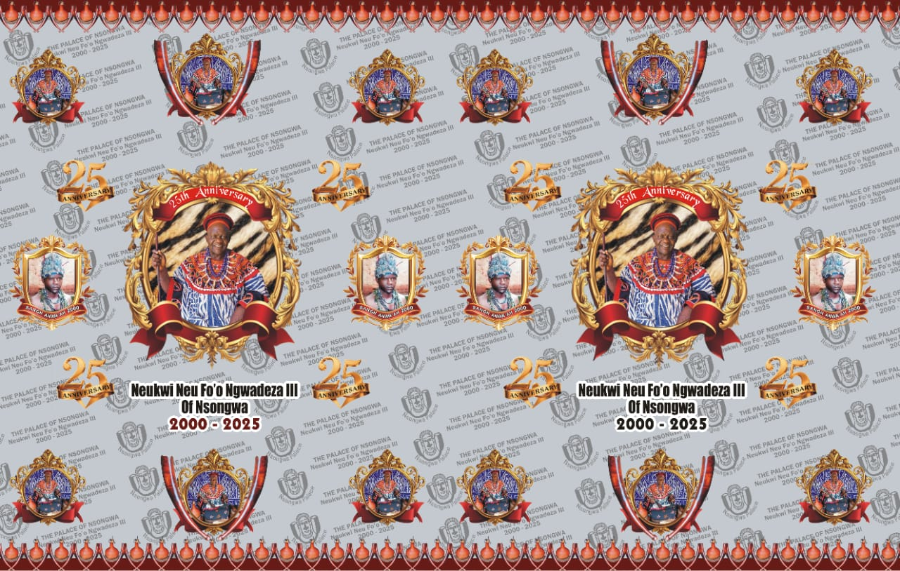

# Nsongwa-Palace

## Astro Starter Kit: Minimal

This is a minimal Astro project.

## 🚀 Project Structure

Inside of your Astro project, you'll see the following folders and files:

```text
/
├── public/
├── src/
│   └── pages/
│       └── index.astro
└── package.json
Astro looks for .astro or .md files in the src/pages/ directory. Each page is exposed as a route based on its file name.🧞 CommandsAll commands are run from the root of the project, from a terminal:CommandActionnpm installInstalls dependenciesnpm run devStarts local dev server at localhost:4321npm run buildBuild your production site to ./dist/npm run previewPreview your build locally, before deployingnpm run astro ...Run CLI commands like astro add, astro checknpm run astro -- --helpGet help using the Astro CLI## Fon's Silver Jubilee



Fon's Silver Jubilee